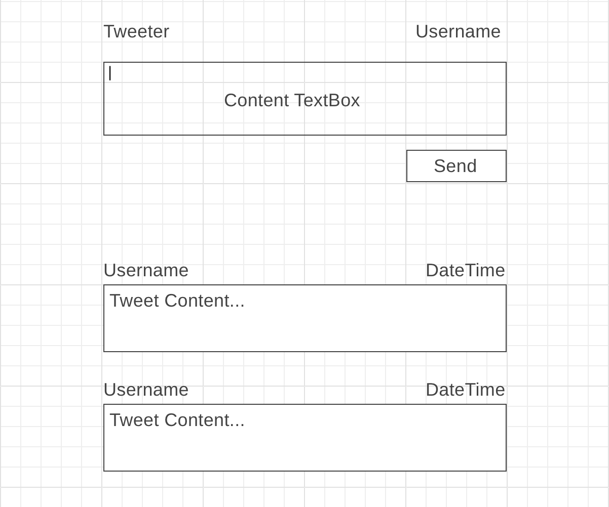

# Tweeter Project

## Steps

### Fork the repository

To work on this project, fork it to your own account!

### Inspect the API Specification

You can find the specification in the file `api.json`, though I would recommend
to use a UI for inspecting it: [OpenApiRenderer][1]

[1]: https://temando.github.io/open-api-renderer/demo/?url=https://raw.githubusercontent.com/trackcode-team/tweeter/master/api.json

### Sketch the Database schema

Based on the API Specification, define a database schema to save the data
permanently.

### Setup a Nodejs Project

Use the `npm init` Command to initialize a nodejs project in this folder.

### Develop the API

The most standard way to develop an API in node these days is the `express`
framework. Google for a guide and start hacking on the API.

I would recommend to start with the simple Level 1 routes and then proceed to
the higher levels.

For storing the data you have multiple options:

1. Relational Database (mysql/mariadb)
1. Nosql Database (mongo)

You may use whatever you feel most comfortable with.

### Build a UI

Independent of the API implementation you need to create a
User Interface to interact with the tweeter service (maybe use static content). This should be a Single Page Web App with React (we recommend to use  [`create-react-app`](https://github.com/facebook/create-react-app)).

> Note the problem when implementing the API and React application in one repository. You can also create your own repository for the web application if it's easier for you.

WireFrame:

> The `username` could be a static variable inside the React application.

